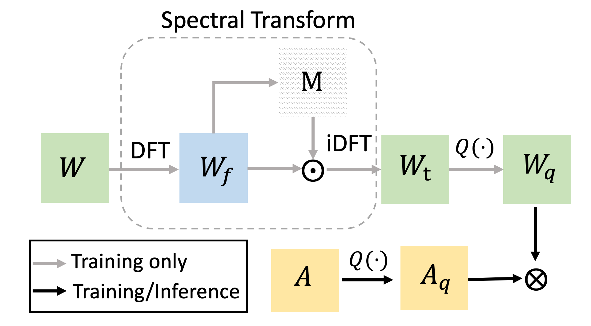

## FAT: Learning Low-Bitwidth Parametric Representation via Frequency-Aware Transformation

## Paper
[Learning Low-Bitwidth Parametric Representation via Frequency-Aware Transformation](https://arxiv.org/abs/2102.07444v1.pdf)
<center class="half">
    
</center>

## Advantages
- Model the task of quantization via a representation transform and a standard quantizer, which enjoys fast training and easy deployment.
- Do not need mixed-precision, adaptive quantization levels or complicated training policy.
- Deepen our understanding of quantization from a frequency-domain viewpoint.
- Can be easily plugged into many CNN architectures to achieve model compression. 


## Citation
If you use FAT_Quantization in your research, please kindly cite this work by
```BibTeX

```

## Installation
This code is trained on PyTorch 1.7.  If you are using old version of PyTorch, you may first do train part and then evaluation part.
```
git clone https://github.com/ChaofanTao/FAT_Quantization.git
cd FAT_Quantization
# conda 安装
conda install pytorch torchvision  -c pytorch
# pip 安装
pip install torch==1.7.1+cu110 torchvision==0.8.2+cu110 -f https://download.pytorch.org/whl/torch_stable.html
```
## Training and Evaluation
If making evaluation of a 4-bit resnet_20 on CIFAR-10 dataset, you can simply use:
```
cd cifar10
python main.py --arch resnet_20 --test_only --bit 4 --gpu 0 
```
The evaluation output  is  in ```test_dir/resnet_20_4bit/```.

You can use ```--arch``` to switch network architectures (resnet_56, vgg_7_bn) and use ```--bit``` for different bits. Similarly, you can train on different network architectures and bits. If you want to train a 5-bit resnet_20,
```
sh train_resnet.sh
```
or
```
python main.py --arch resnet_20  --bit 5 --gpu 0
```
You can use argument ```--use_pretrain```  to decide whether training from scratch. For example, if using ```--use_pretrain``` to train a 4-bit model, it will start training from 5-bit pretrained checkpoint.

Training and evaluation on [ILSVRC2012-ImageNet](http://www.image-net.org/download-images) is similar. The directory of ImageNet ```{ImageNet_data_path}``` should be like that:
```
ImageNet_data_path
    |- train
        |-n01675722
            |-n01675722_1523.JPEG
            |-...
        
    |- val
        |-n01675722
            |-ILSVRC2012_val_00003904.JPEG
            |-...
```

For example, training resnet_34, 
```sh train_resnet.sh```
or
```
python main.py --arch resnet_34 --data_dir {ImageNet_data_path} \
--batch_size 512 --bit 4 --gpu 0,1,2,3
```

In default setting, we employ the proposed FAT with uniform quantizer. You can also employ logarithmic 
quantizer by switching ```power=True``` in ```class FAT_QuantConv2d``` in ```models/fat_quantization.py```

## Core Code
The proposed transform FAT:
```python
def weight_deactivate_freq(weight, transform=None, fc=False):
    """
    weight:
        for conv layer (without bias), weight is a 4-D tensor with shape [cout, cin, kh, kw]
        for fc layer, weight is a 2-D tensor with shape [cout, cin]
    transform:
        The fully-connected layer used for transform the magnitude.
    fc:
        whether a conv layer or a fc layer.
    """

    if fc:
        cout, cin = weight.size()
    else:
        cout, cin, kh, kw = weight.size()

    device = weight.device
    # flatten weight
    reshape_weight = weight.reshape(cout, -1)
    stack_w = torch.stack([reshape_weight, torch.zeros_like(reshape_weight).to(device)], dim=-1)
    # map weight to frequency domain
    # compared with spatial domain, the information in frequency domain is much more concentrated 
    # on several frequency bases.
    fft_w = torch.fft(stack_w, 1)
    # compute the norm in the frequency domain
    mag_w = torch.norm(fft_w, dim=-1)
    assert transform is not None
    freq_score = transform(torch.transpose(mag_w, 0, 1))
    # generate soft mask for each element in weight spectrum
    mask = torch.sigmoid(freq_score)
    mask = mask.permute(1, 0)
    restore_ffw = fft_w * mask.unsqueeze(2)

    # map weight back to spatial domain
    restore_w = torch.ifft(restore_ffw, 1)[..., 0]

    if fc:
        restore_w = restore_w.view(cout, cin)
    else:
        restore_w = restore_w.view(cout, cin, kh, kw)
    return restore_w, (mask.max().item(), mask.min().item())

# Just send the transformed weight to a simple quantizer, e.g. uniform quantizer
weight_transform = weight_deactivate_freq(weight, transform, fc)  
weight_q = uniform_quantizer(weight_transform)  

activation_q = uniform_quantizer(activation) 
output = conv(activation_q, weight_q)
```


## Accuracy on uniform quantizer
 Results of CIFAR-10 dataset

| Weight/Activation  |  ResNet-20   | ResNet-56  | VGG-Small |
|  ----  | ----  |  ----  |  ----  |
| 4 bit / 4 bit |  93.2 | 94.6 |94.4 |
| 3 bit / 3 bit | 92.8  | 94.3 |94.3 |

Results of ImageNet dataset

|Weight/Activation  |  ResNet-20   | ResNet-34  | MobileNetV2 |
|  ----  | ----  |  ----  |  ----  |
|5 bit / 5 bit |  70.8 | 74.6 |69.6 |
|4 bit / 4 bit |  70.5 | 74.1 |69.2 |
|3 bit / 3 bit | 69.0  | 73.2 |62.8 |

The performance may has small variation (+- 0.2) in different times of experiments due to different random seeds.


## License
FAT_Quantization is released under MIT License.

## Acknowledgements
This code is inspired by [APoT](https://github.com/yhhhli/APoT_Quantization). We thanks for this open-source implementation.
